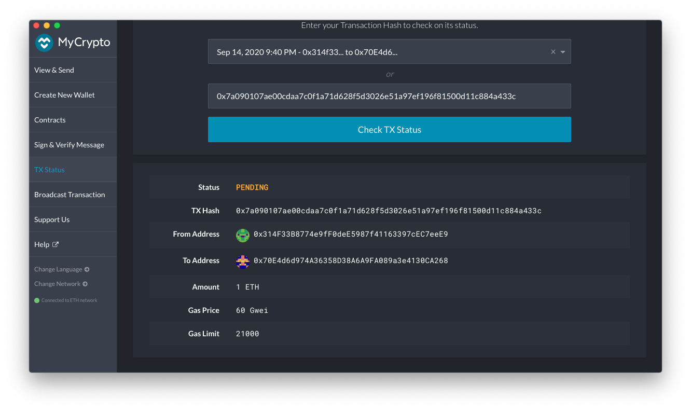

# TX Bank Block Chain

## Dependencies / Environment SetUp

To learn about the dependencies required to run this project as well as how to set up your environment view the [supplemental document](Supplemental/blockchain-install-guide.md). 

## Steps to Create the Proof of Authority Blockchain Network and Nodes

* Create accounts for two nodes for the network with a separate `datadir` for each using `geth`.
    * ./geth --datadir node1 account new
    * ./geth --datadir node2 account new

* Run `puppeth`, name your network, and select the option to configure a new genesis block.

* Choose the `Clique (Proof of Authority)` consensus algorithm.

* Paste both account addresses from the first step one at a time into the list of accounts to seal.

* Paste them again in the list of accounts to pre-fund. There are no block rewards in PoA, so you'll need to pre-fund.

* You can choose `no` for pre-funding the pre-compiled accounts (0x1 .. 0xff) with wei. This keeps the genesis cleaner.

* Complete the rest of the prompts

## Setps to Run the Blockchain POA Network

* Initialize each node with the new `networkname.json` with `geth`.
    * ./geth --datadir node1 init networkname.json
    * ./geth --datadir node2 init networkname.json

* Runs the nodes in separate terminal windows with the commands:
    *  ./geth --datadir node1 --unlock "SEALER_ONE_ADDRESS" --mine --rpc --allow-insecure-unlock
    *  ./geth --datadir node2 --unlock "SEALER_TWO_ADDRESS" --port 30304 --bootnodes "enode://SEALER_ONE_ENODE_ADDRESS@127.0.0.1:30303" --ipcdisable --allow-insecure-unlock
    * type your password and hit enter - even if you can't see it visually!

## Using MyCrypto GUI to visualize transactions

* Use the MyCrypto GUI wallet to connect to the node with the exposed RPC port.

* You will need to use a custom network, and include the chain ID, and use ETH as the currency.

* Import the keystore file from the node1/keystore directory into MyCrypto. This will import the private key.

* Send a transaction from the node1 account to the node2 account.

* Copy the transaction hash and paste it into the "TX Status" section of the app, or click "TX Status" in the popup.

* You'll see the transaction listed like below.

* Be very patient and eventually your transaction will go through and be successful. If it takes a very long time, you might want to upgrade your hardware! 
